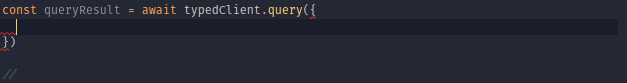

# typed-apollo-client

This library augments an instance of [ApolloClient](https://github.com/apollographql/apollo-client) with type information for variables and returned data, as generated by [graphql-to-typescript](TODO).

If you're using React, also check out [typed-apollo-hooks](TODO).

## Setup

Install dependencies:

```bash
npm i @bearbytes/typed-apollo-client
npm i -D @bearbytes/graphql-to-typescript
```

Generate type information from your client-side documents (see detailed instructions [here](TODO)):

```bash
npx graphql-to-typescript           \
  --schema my-endpoint              \
  --documents src/**/*.gql          \
  --outFile src/graphql-types.ts
```

Create an instance of `ApolloClient` and add the type information:

```typescript
import ApolloClient from 'apollo-boost'
import { createClient } from '@bearbytes/typed-apollo-client'
import GraphQLTypes from './graphql-types' // file generated by graphql-to-typescript

const untypedClient = new ApolloClient({ uri: 'http://my-endpoint' })
const typedClient = createClient(GraphQLTypes, apolloClient)
```

## Operations (Queries, Mutations)

The typed client provides the `query`, `watchQuery` and `mutate` methods, which mirror the methods of `ApolloClient` for the most part.  
**Subscriptions** are not yet supported (WIP!)

However, the way an operation is selected is different:  
In the original ApolloClient, we pass a a compiled GraphQL Document (usually a string wrapped with the [graphql-tag](https://github.com/apollographql/graphql-tag) helper) as `query` or `mutation` property to the method.  
In the typed client, we need only give the `operationName` to the method:

```typescript
const queryResult = await typedClient.query({
  operationName: 'fetchProjectById',
  variables: { id: 3 },

  // optional configuration passed to ApolloClient:
  fetchPolicy: 'cache-first',
  errorPolicy: 'ignore',
})
```

Thanks to the type information, we get autocomplete for the `operationName`. Also, once given, the `variables` are typechecked as well:



## Cache manipulation (Mutations)

The ApolloClient allows us to update its internal cache as the result of a mutation. For example, when we execute a `createUser` mutation, we may also want to update the cached value for our `getAllUsers` query.

To make this process easier, the `update` property of the `mutate` gives access to a typesafe cache object:

```typescript
typedClient.mutate({
  operationName: 'createUser',
  variables: { name: 'Leeroy Jenkins' },
  update: (cache, mutateResult) => {
    // The mutation will return the created user, unless something went wrong
    const createdUser = mutateResult.data && mutateResult.data.createUser

    // If we did not create a user, don't update the cache
    if (!createdUser) return

    // Here we can update the data for different queries.
    cache.updateQuery(
      {
        operationName: 'getAllUsers',
        // If the query takes any variables, they must be given here as well,
        // in the same order as they are given when the query is executed
        variables: {},
      },
      (cachedData) => {
        // cachedData may be empty when we never executed the query before
        if (!cachedData) return

        // If there is data, then we know what its shape is,
        // so the following line is fully type-checked.
        // We may simply mutate the value in here.
        // The listeners of this query will be notified automatically about the new data.
        cachedData.users.push(createdUser)
      }
    )
  },
})
```

`updateQuery` is the simplest way to update the data for a particular query. For more complex updates over multiple queries, you can use a combination of `readQuery` and `writeQuery`:

```typescript
update: (cache, mutateResult) => {
  const cachedData = cache.readQuery({ operationName: 'getAllUsers' })
  const updatedData = complicatedStuff(cachedData)
  cache.writeQuery({ operationName: 'getAllUsers', data: updatedData })
}
```
